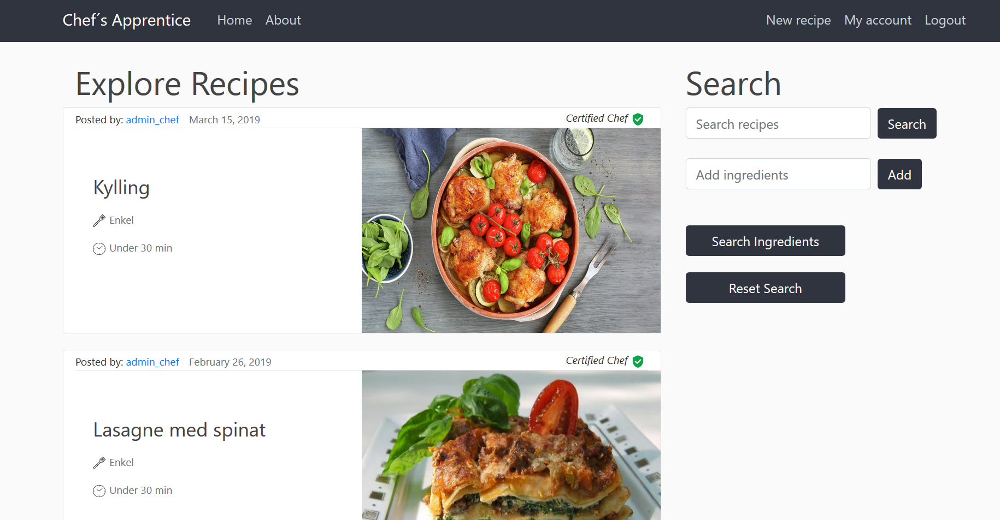

<h1>Chef's Apprentice</h1>
Med bakgrunn i at tusenvis av nordmenn hver dag går sultne fordi de ikke vet hva de skal lage til middag, samtidig som de årlig kaster tonnevis av ubrukte ingredienser har vi jobbet med å utvikle applikasjonen Chef’s Apprentice som lar alminnelige brukere og sertifiserte kokker dele og tilgjengeliggjøre sine oppskrifter for andre brukere av applikasjonen, samt å kunne søke på oppskrifter basert på hvilke ingredienser de selv har tilgjengelig. Hovedhensikten med Chef’s Apprentice er å effektivisere bruken av ingredienser, slik at det skal bli enklere for Kari og Ola Normann å ta i bruk de ingredienser han han tilgjengelig. Dette skal sørge for at mindre mat kastes, og applikasjonen vil da bidra til å redusere og på sikt løse det omfattende matsvinnproblemet både Norge og verden står overfor.
<h2>Demo</h2>
Etter å ha logget inn på siden vil du bli møtt med denne hjemmesiden:

Herfra har du tilgang på all funksjonalitet i applikasjonen.

Oppskriftene som vises først her er fra verifiserte kokker, noe som kan ses over til høyre av oppskriftsbildet, og så alle oppskrifter fra alminnelige brukere senere. Man kan trykke på de enkelte oppskriftene for mer informasjon om dem. Her vises alle ingredienser med enheter og mengder, samt fremgangsmåten. Herfra har man også muligheten til å laste ned oppskrifter, og redigere eller slette dem hvis man enten eier oppskriften selv eller er verifisert kokk / administrator.

I søkefeltene kan du søke oppskriftsdatabasen enten på oppskriftsnavn eller på så mange ingredienser du vil. Søker du på mer enn en oppskrift vil søkeresultatet sorteres etter to faktorer; antall treff på ingredienser er den overordnede prioriteten, men har flere oppskrifter like mange treff på ingredienser, vil også her verifiserte kokkers oppskrifter vises først.

Ved å trykke på 'New Recipe' kommer man til et enkelt skjema der det er mulighet for å legge til nye oppskrifter med all relevant informasjon.

Under 'My Account' finner man informasjon om sin egen bruker og muligheten til å bytte passord. Her finner man også en oversikt over alle oppskrifter en selv har lagt ut på siden.
<h2>Kjør applikasjonen</h2>
Applikasjonen er bygd med [python](https://www.python.org/) backend og [django](https://docs.djangoproject.com/en/2.2/) rammeverk rundt hele prosjektet.

For å få kjørt applikasjonen vil det først være hensiktsmessig å klone prosjektet inn i sin foretrekkende IDE, som støtter python, f.eks. ved terminal:
```sh
$ git clone https://gitlab.stud.idi.ntnu.no/programvareutvikling-v19/gruppe-64.git
```
Videre burde det installeres et virtual environment i prosjektet slik at det kan kjøres. Sørg så for at alle tilleggspakker gitt i requirements.txt er installert. Deretter burde nå applikasjonen være klar for å kjøres.
<h4>Tester</h4>
Innebygd i prosjektet ligger en pipeline som kjører prosjektets testing hver gang prosjektet oppdateres, slik at det alltid er en fungerende versjon som ligger ute. Status på denne kan ses på gitlab siden til prosjektet under CD/CI og pipelines. Ellers kan også testene kjøres via test.py direkte.
